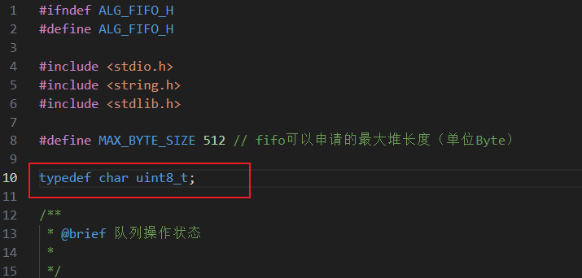

# 使用方法
## 1. 文件添加方法
*  ### 第一步 添加 *alg_fifo.cpp/.h*  和 *dvc_message.cpp/.h* 文件到工程*User*文件夹下
*  ### 第二步 确保 *alg_fifo.h* 可被 *dvc_message.h* 包含
*  ### 第三步 删除*alg_fifo.h* 中的第10行，直接删掉这一行就行
 

## 2.使用机制
*  ### 第一步   创建一个消息中心实例      
 
    ```c++
    // 创建消息中心实例 
    Class_Message Message_Center;
    ```
*  ### 第二步  在消息中心注册一个话题  并  创建一个发布者实例
  
    ```c++
    // 注册发布者，fisrt_pub_topic是第一个发布者指针，topic是话题名，sizeof(Data)是话题消息数据长度
    Publisher First_Pub_Topic = Message_Center.PubRegister("topic", sizeof(Data));
    ```

*  ### 第三步 创建该话题的 订阅者 实例

    ```c++
    // 注册订阅者，first_sub_topic是第一个订阅者指针，topic是话题名，sizeof(Data)是话题消息数据长度
    Subscriber First_Sub_Topic = Message_Center.SubRegister("topic", sizeof(Data));
    ```
*  ### 第四步 发布者通过消息中心对该话题 发布消息
 
    ```c++
    Data data_pub = {100, 1, 20};
    // 根据发布者指针 和 数据发布消息
    Message_Center.PubPush_Message<Data>(First_Pub_Topic, data_pub);
    ```

*  ### 第五步 订阅者通过消息中心 获取消息
    ```c++
    Data data_sub;
    // 根据订阅者指针 和 数据获取消息
    Message_Center.SubGet_Message<Data>(First_Sub_Topic, data_sub);
    ```
## 3. 更多配置

* *dvc_message.h*
```c++
#define MAX_TOPIC_NAME_LEN 32 // 最大的话题名长度,每个话题都有字符串来命名
#define MAX_TOPIC_COUNT 12    // 消息中心最多支持的话题数量
#define QUEUE_SIZE 10         // 每个订阅者的消息队列大小
```
* *alg_fifo.h*
```c++
#define MAX_BYTE_SIZE 512     // 消息队列可以申请的最大堆长度（单位Byte）
```
## 4.  注意事项！
如果话题所对应的数据类型如果是自定义数据类型`Struct`，就必须对这个结构体使用*一字节对齐* ，不同编译器下字节对齐关键字不一样，`arm-none-eabi-gcc`器使用`#pragma pack(1)==`关键字,`AC6`编译器下采用`__attribute__((packed))`关键字来一字节对齐，由于我们新框架本质还是用的AC6编译器，于是采用`__attribute__((packed))`关键字即可。  
AC6 例：
```c++
struct Data
{
   uint8_t name[5];
   uint8_t age;
} __attribute__((packed));  //一字节对齐
```

* 重要的事情说三遍！！！  
必须对自定义数据类型`Struct`使用*一字节对齐*  
必须对自定义数据类型`Struct`使用*一字节对齐*  
必须对自定义数据类型`Struct`使用*一字节对齐*


